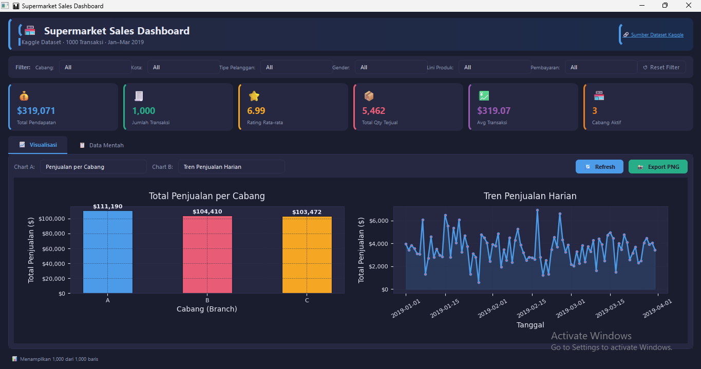
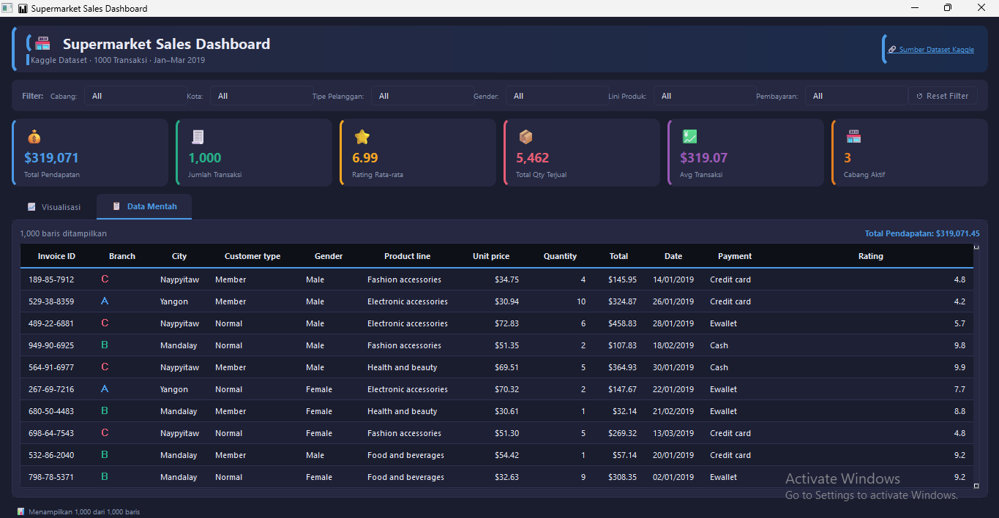
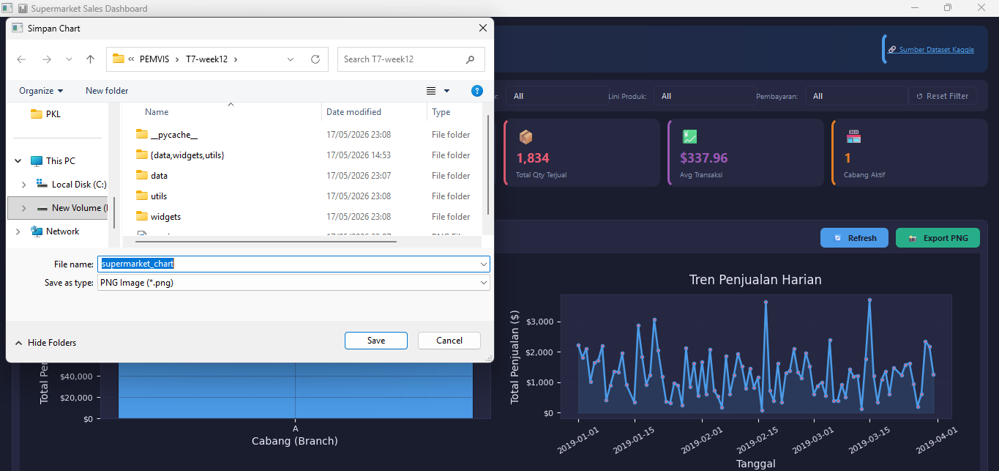
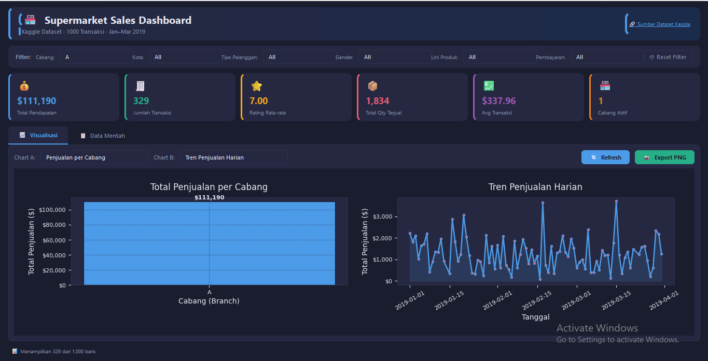
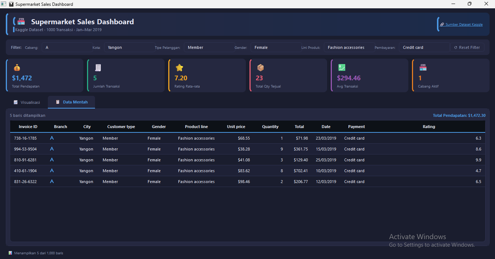

# 📊 Supermarket Sales Dashboard

Aplikasi ini adalah sebuah dashboard analitik interaktif yang dibangun menggunakan framework PySide6 sebagai antarmuka grafis (GUI) dan Matplotlib sebagai mesin visualisasi data. Tujuan utamanya adalah membantu pengguna memahami pola penjualan supermarket secara visual dan interaktif, langsung dari satu jendela aplikasi tanpa perlu membuka tools eksternal seperti Excel atau browser.
Data yang digunakan berasal dari Supermarket Sales Dataset yang tersedia di Kaggle (https://www.kaggle.com/datasets/faresashraf1001/supermarket-sales), berisi 1.000 baris transaksi penjualan dari tiga cabang supermarket di Myanmar selama periode Januari hingga Maret 2019. Setiap baris mewakili satu transaksi dengan informasi lengkap seperti cabang toko, kota, jenis pelanggan, gender, kategori produk, metode pembayaran, jumlah barang, harga satuan, total pembayaran, pajak, dan rating kepuasan pelanggan.
---

## 🗂️ Dataset

**Nama Dataset:** Supermarket Sales Dataset  
**Sumber (Kaggle):** https://www.kaggle.com/datasets/faresashraf1001/supermarket-sales  
**Jumlah Data:** 1.000 baris transaksi (Jan – Mar 2019)

### Kolom Utama

| Kolom | Tipe | Keterangan |
|-------|------|------------|
| `Invoice ID` | String | ID unik tiap transaksi |
| `Branch` | Kategori (A/B/C) | Kode cabang supermarket |
| `City` | Kategori | Kota cabang (Yangon, Mandalay, Naypyitaw) |
| `Customer type` | Kategori | Tipe pelanggan (Member / Normal) |
| `Gender` | Kategori | Jenis kelamin pelanggan |
| `Product line` | Kategori | Kategori produk (6 kategori) |
| `Unit price` | Float | Harga satuan produk (USD) |
| `Quantity` | Integer | Jumlah item yang dibeli |
| `Tax 5%` | Float | Pajak 5% dari subtotal |
| `Total` | Float | Total pembayaran termasuk pajak |
| `Date` | Date | Tanggal transaksi |
| `Time` | String | Jam transaksi |
| `Payment` | Kategori | Metode pembayaran (Ewallet / Cash / Credit card) |
| `cogs` | Float | Cost of Goods Sold (harga pokok) |
| `gross margin percentage` | Float | Margin kotor dalam persen |
| `gross income` | Float | Pendapatan kotor |
| `Rating` | Float | Rating kepuasan pelanggan (4.0 – 10.0) |

---

## 🚀 Cara Menjalankan

### 1. Install Dependencies

```bash
pip install PySide6 matplotlib pandas numpy
```

### 2. Jalankan Aplikasi

```bash
cd supermarket_dashboard
python main.py
```

---

## 🗂️ Struktur Project

```
supermarket_dashboard/
├── main.py                  
├── main_window.py           
├── README.md
│
├── data/
│   └── supermarket_sales.csv  
│
├── utils/
│   ├── __init__.py
│   └── data_loader.py       
│
└── widgets/
    ├── __init__.py
    ├── chart_widget.py      
    ├── table_widget.py      
    └── stats_widget.py      
```

---

## ✨ Fitur

| Fitur | Keterangan |
|-------|------------|
| 📋 Data Mentah | QTableWidget dengan 1.000 baris, sortable, warna per cabang |
| 📈 6 Jenis Chart | Bar, Pie, Line, Horizontal Bar, Histogram, Grouped Bar |
| 🔽 Filter Kategori | Filter berdasarkan Cabang, Kota, Tipe Pelanggan, Gender, Produk, Pembayaran |
| 🔄 Refresh | Tombol refresh untuk render ulang chart |
| 📸 Export PNG | Simpan chart aktif ke file PNG (150 DPI) |
| 💹 KPI Cards | 6 kartu statistik: Pendapatan, Transaksi, Rating, Qty, Avg, Cabang |
| 🎨 Dark Mode | UI dark mode responsif, rapi saat di-resize |

---

## 📊 Jenis Chart yang Tersedia

1. **Penjualan per Cabang** – Bar chart total pendapatan tiap cabang
2. **Metode Pembayaran (Pie)** – Distribusi proporsi pembayaran
3. **Tren Penjualan Harian** – Line chart dengan area fill
4. **Penjualan per Lini Produk** – Horizontal bar chart
5. **Distribusi Rating** – Histogram sebaran rating pelanggan
6. **Gender & Produk (Grouped Bar)** – Perbandingan penjualan pria vs wanita per produk

---

## 1. Halaman Utama


## 2. Data Mentah


## 3. Export Gambar


## 4. Pencarian Menggunakan Filter (CHART)


## 5. Pencarian Menggunakan Filter (DATA MENTAH)

```
